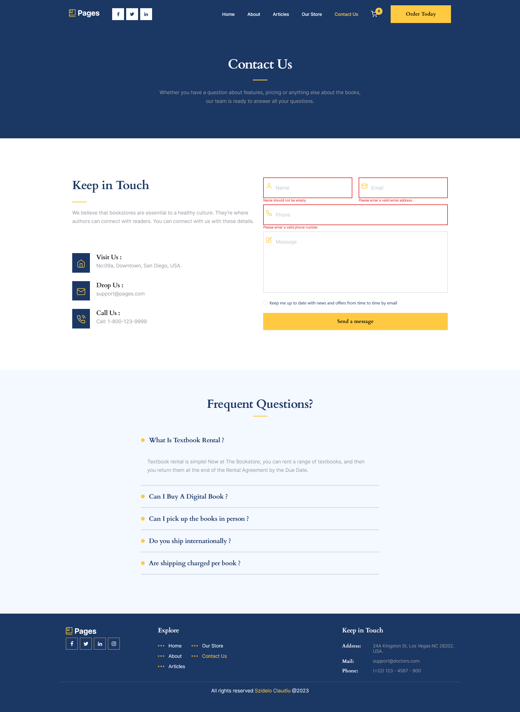
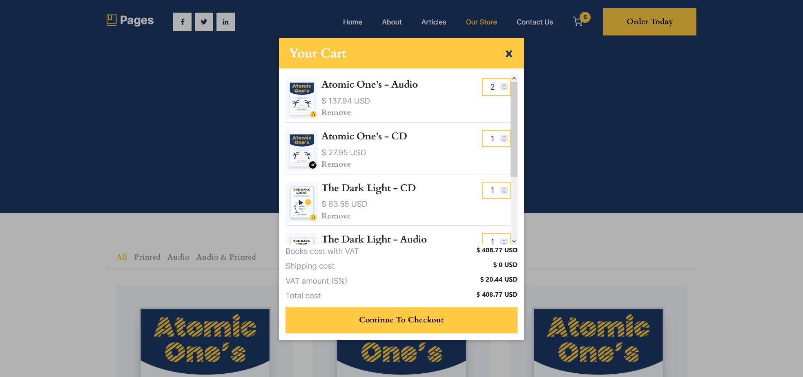
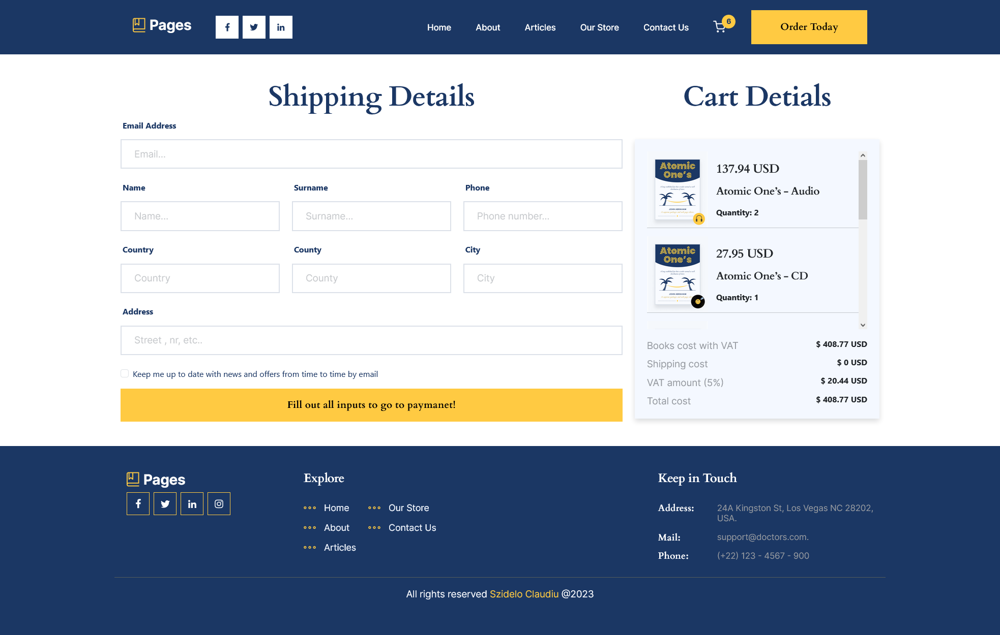
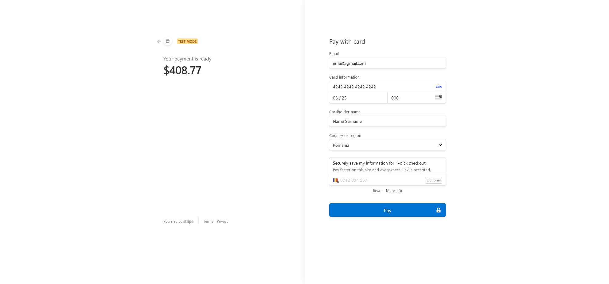
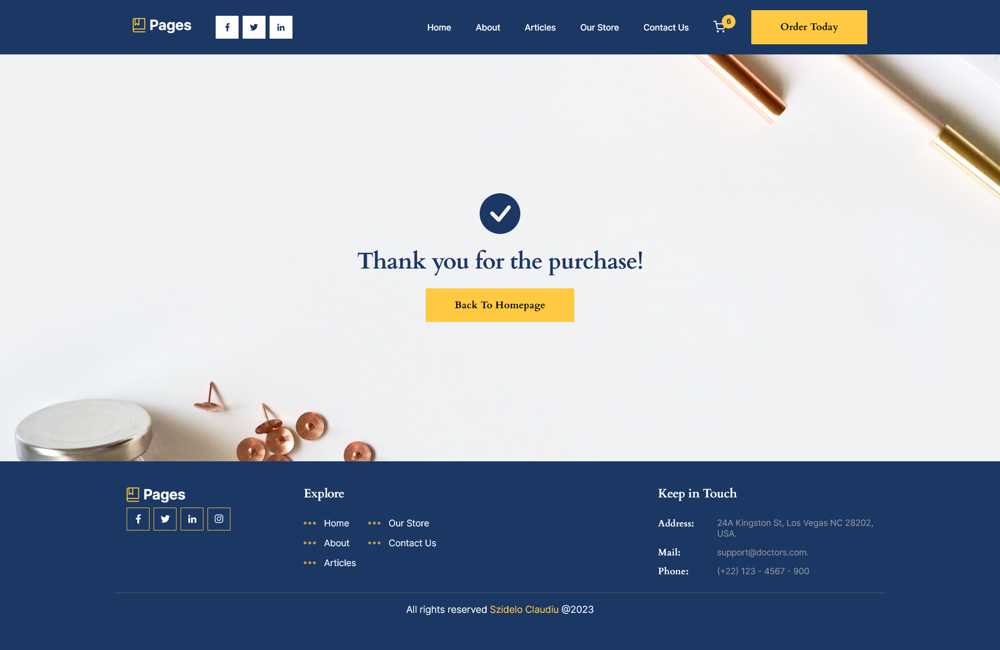

# Software Development Academy Final Project

Welcome to the final project of the SDA course, "JavaScript from Scratch"! This project aims to provide a seamless user experience, allowing users to navigate through various pages and access content on any device. The application fetches articles and news using the free version of newsapi.org, specifically designed to work on localhost.

!!!Please note that due to the utilization of the free version of newsapi.org, the project is designed to function on localhost only. Check [screenshots](#screenshot) to see the article page.

## Table of contents

-   [Overview](#overview)
    -   [Key Features](#key-features)
    -   [The Challenge](#the-challenge)
    -   [Screenshot](#screenshot)
    -   [Links](#links)
-   [My process](#my-process)
    -   [Built with](#built-with)
    -   [What I learned](#what-i-learned)
-   [Author](#author)

## Overview

### Key Features

#### Articles Page

-   Users can explore articles and search for specific topics using keywords.
-   Clicking on an article generates a new page with detailed information sourced from the API response.

#### Our Store page

-   Displays a list of products with additional information.
-   Users can add products to the shopping cart for a convenient shopping experience.

#### Contact Page

-   Users can fill out a form to send emails directly.
-   Emails are sent to a specified personal email address using emailJs.

#### Shopping Cart

-   Allows users to view added products, including total costs with shipping and VAT.
-   Users can modify item quantities or remove items from the cart.

#### Checkout

-   Clicking "Continue to Checkout" directs users to a checkout form.
-   The checkout form allows users to review their cart and proceed to payment using the Stripe payment gateway.

### The challenge

Users should be able to:

-   View the optimal layout for the app depending on their device's screen size
-   See hover states for all interactive elements on the page
-   Search articles by keywords and see detialed information by accessing the article
-   Add Products to shopping cart where can read, update or delete
-   Sent email by filling out the contact form
-   Se errors if the information entered in the contact form is not valid
-   Go to checkout and fill shipping address
-   See errors is the checkout form is not filled properly
-   Proceed to payment using the Stripe payment gateway

### Screenshot









### Links

-   Solution URL: [Github](https://github.com/Szidelo/Book-store-vuejs)
-   Live Site URL: [Demo](https://book-store-vuejs.vercel.app/home)

## My process

### Built with

-   Semantic HTML5 markup
-   CSS custom properties
-   Flexbox
-   Bootstrap
-   Typescript
-   Composition API
-   [Vue](https://vuejs.org/) - JS library
-   [Vue Router](https://router.vuejs.org/) - Vue framework
-   [Newsapi.org](https://newsapi.org/)
-   [SweetAlert2](https://sweetalert2.github.io/)
-   [Stripe](https://stripe.com/en-ro)

### What I learned

With this project I learned a lot about vue js. I learned to use classes to define and organize logic:

```js
// Cart class
import CartItem from "./CartItem";
import { ref } from "vue";

class Cart {
	private items = ref<CartItem[]>([]);
	private key = "cart-items";
	private shipmentCost = 30;

	constructor() {
		this.items.value = this.getItems();
	}

	private saveToLocalStorage() {
		localStorage.setItem(this.key, JSON.stringify(this.items.value));
	}

	public addItem(item: CartItem) {
		const existingItemIndex = this.items.value.findIndex(
			(cartItem) => cartItem.id === item.id
		);

		if (existingItemIndex !== -1) {
			this.items.value[existingItemIndex].quantity += item.quantity;
		} else {
			this.items.value.push(item);
		}

		this.saveToLocalStorage();
	}

	public getItems() {
		return JSON.parse(localStorage.getItem(this.key) || "[]") as CartItem[];
	}

	public getItemPrice(item: CartItem) {
		return +((item.price * item.quantity).toFixed(2))
	}

	public getShipmentCost() {
		return this.getTotal() < 100 && this.getTotal() !== 0 ? this.shipmentCost : 0;
	}

	public getTotal() {
		const total = this.items.value.reduce((acc, item) => {
			const itemPrice = +(item.price * item.quantity).toFixed(2);
			return acc + itemPrice;
		}, 0);

		return total;
	}

	public getTotalWithShipment() {
		return this.getTotal() < 100
			? this.getTotal() + this.getShipmentCost()
			: this.getTotal();
	}

	public getTotalQuantity() {
		return this.items.value.reduce((total, item) => {
			return (total += item.quantity);
		}, 0);
	}


	public removeItem(itemId: string) {
		const index = this.items.value.findIndex((item) => {
			return item.id === itemId;
		});

		this.items.value.splice(index, 1);

		if(this.items.value.length > 0) {
			this.saveToLocalStorage();
		} else {
			localStorage.removeItem(this.key);
		}
	}

	public updateQuantity(item: CartItem, newQuantity: number) {
		const index = this.items.value.findIndex((book) => {
			return book.id === item.id;
		});

		newQuantity < 1 ? 1 : newQuantity;

		this.items.value[index].quantity = newQuantity;

		this.saveToLocalStorage();
	}
}

export default Cart;
```

```js
// to implement stripe with express
const express = require("express");
const router = express.Router();
const stripe = require("stripe")(process.env.STRIPE_API_PRIVATE_KEY);

router.post("/create-payment-link", async (req, res) => {
	try {
		const { amount, currency } = req.body;

		// Create a Checkout Session
		const session = await stripe.checkout.sessions.create({
			payment_method_types: ["card"],
			line_items: [
				{
					price_data: {
						currency,
						product_data: {
							name: "Your payment is ready",
						},
						unit_amount: amount,
					},
					quantity: 1,
				},
			],
			mode: "payment",
			success_url: "http://localhost:8080/success",
			cancel_url: "http://localhost:8080/checkout",
		});

		// Send the hosted payment link as a response
		res.json({ paymentLink: session.url });
	} catch (error) {
		console.error(error.message);
		res.status(500).send("Internal Server Error");
	}
});

module.exports = router;
```

```js
// form validation with regex and to send email with emailJs
        const validateForm = () => {
			const nameRegex = /^[a-zA-Z -]+$/;
			const emailRegex = /^[\w-.]+@([\w-]+\.)+[\w-]{2,4}$/;
			const phoneRegex = /^\+?[0-9]{10,}$/;

			const isInputValid = (value: string, regex: RegExp) => {
				return value !== "" && regex.test(value);
			};

			isNameValid.value = isInputValid(formData.name, nameRegex);
			isEmailValid.value = isInputValid(formData.email, emailRegex);
			isPhoneValid.value = isInputValid(formData.phone, phoneRegex);

			isFormValid.value =
				isNameValid.value && isEmailValid.value && isPhoneValid.value;
		};

		const sendEmail = (e: Event) => {
			validateForm();

			if (isFormValid.value === false) {
				return;
			}

			emailjs
				.sendForm(
					"service_kvzd81h",
					"template_0hkc0pf",
					e.target as HTMLFormElement,
					"yc9EDnZIlelh6XRF8"
				)
				.then(
					(result: EmailJSResponseStatus) => {
						console.log(result.text);
						if (result.text === "OK") {
							formData.name = "";
							formData.email = "";
							formData.phone = "";
							formData.message = "";
							formData.news = false;
						}
					},
					(error) => {
						console.log(error.text);
					}
				);
		};
```

```js
// fetch articles from newsapi.org with dynamic keyword

const fetchNews = async (keyWord: string) => {
	const response = await axios.get(
		`https://newsapi.org/v2/everything?q=${keyWord}&searchIn=title&apiKey=${API_KEY}`
	);

	const filteredArticles = response.data.articles.filter(
		(article: NewsArticle, index = 0) => {
			if (index < 99) {
				return (
					article.urlToImage !== "" &&
					article.urlToImage !== null &&
					article.title !== "" &&
					response.data.articles[index + 1]?.title !== article.title
				);
			} else {
				return article.urlToImage !== "" && article.title !== "";
			}
		}
	);

	return filteredArticles;
};

// use a class to manage logic

import NewsArticle from "./NewsArticle";
import { fetchNews } from "@/fetch/newsApi";
import { ref } from "vue";

class NewsArticleList {
	private data = ref<NewsArticle[]>([]);

	async fetchData(keyWord: string) {
		const response = (await fetchNews(keyWord)) as NewsArticle[];

		return (this.data.value = response);
	}

	serach(keyWord: string) {
		return !keyWord ? this.fetchData("books") : this.fetchData(keyWord);
	}

	getData(): NewsArticle[] {
		return this.data.value;
	}
}

export default NewsArticleList;
```

## Author

-   Github - [Szidelo](https://github.com/Szidelo)
-   Linkedin - [Claudiu Szidelo](https://www.linkedin.com/in/claudiu-szidelo-671b1324a/)
-   Frontend Mentor - [@Szidelo](https://www.frontendmentor.io/profile/Szidelo)
